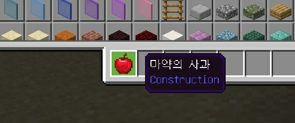
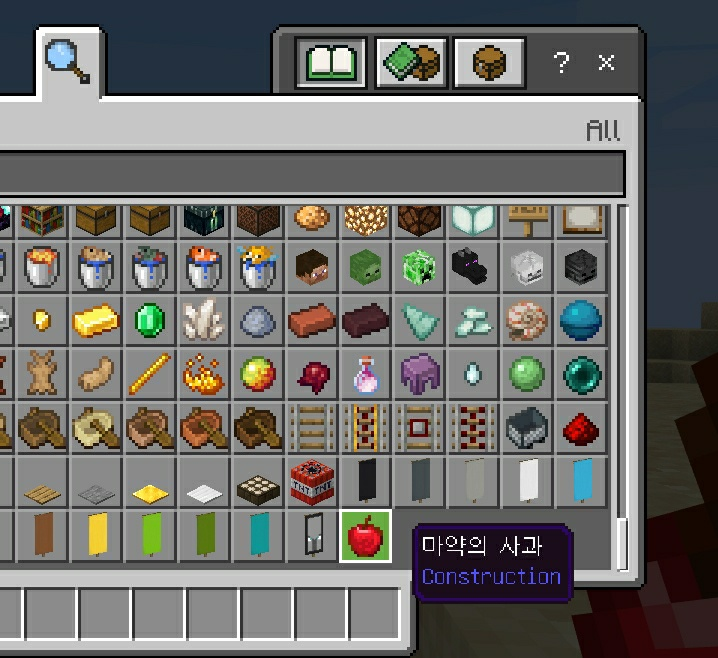

# CustomItemLoader
[Plugin] PocketMine-MP adds items using ItemComponent Packet.
You can implement the items and tools you want!

# Communications

# Properties
|     Property Name     |     Property Type     |                         Property Description                     |
|:---------------------:|:---------------------:|:-----------------------------------------------------------------:|
|     allow_off_hand    |        boolean        |      If the item is permitted in the offhand inventory slot.      |
|  animates_in_toolbar  |        boolean        |                                                                   |
| can_destroy_in_creative	|      boolean        |                                                                   |
|    creative_category  |        inteaer        |                                                                   |
|    creative_group     |        string         |                                                                   |
|       damage          |        inteager       |                                                                   |
|    enchantable_slot   |        string         |                                                                   |
|    enchantable_value  |        integer        |                                                                   |
|       explodable      |        boolean        |                                                                   |
|          foil         |        boolean        |                                                                   |
|      frame_count      |        integer        |                                                                   |
|     hand_equipped     |        boolean        |          If the item should be visually held like a tool.         |
|  ignores_permissions  |        boolean        |                                                                   |
|     liquid_clipped    |        boolean        |                                                                   |
|     max_stack_size    |        integer        | The maximum amount of this item that can be in an inventory slot. |
|      mining_speed     |         float         |                                                                   |
|      mirrored_art     |        boolean        |                                                                   |
|    requires_interact  |        boolean        |                                                                   |
|     should_despawn    |        boolean        |                                                                   |
|     stacked_by_data   |        boolean        |                                                                   |
|      use_animation    |        integer        |                                                                   |
|      use_duration     |        integer        |                                                                   |

#images

